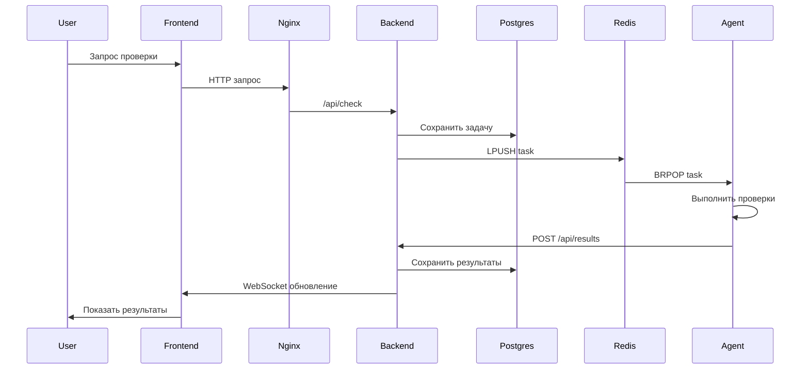

# Диаграмма последовательности проверки

```mermaid
sequenceDiagram
    participant U as User
    participant F as Frontend
    participant N as Nginx
    participant B as Backend
    participant P as Postgres
    participant R as Redis
    participant A as Agent

    U->>F: Запрос проверки
    F->>N: HTTP запрос
    N->>B: /api/check
    B->>P: Сохранить задачу
    B->>R: LPUSH task
    R->>A: BRPOP task
    A->>A: Выполнить проверки
    A->>B: POST /api/results
    B->>P: Сохранить результаты
    B->>F: WebSocket обновление
    F->>U: Показать результаты
```